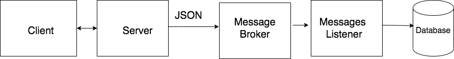

# asychat

Desktop app that allows you to chat without auth.


# Stack

- Python3
- [gRPC](https://grpc.io/)
- [RabbitMQ](https://www.rabbitmq.com/)
- [SQLAlchemy](https://www.sqlalchemy.org/)
- [SQLite](https://www.sqlite.org/index.html)
- [threading](https://docs.python.org/3/library/threading.html)
- [loguru](https://github.com/Delgan/loguru)
- [tkinter](https://docs.python.org/3/library/tkinter.html)

## Desctiption
The main goal was to create online chat with client-server architecture.

- User that wants to chat should only type in his nickname. After that, he will be connected to the server and can chat with other members.

- App allows users to see when someone connected or disconnected from the chat.

- All interaction log between clients and server records to database.

## Architecture


Client and Server communicate only by gRPC. 

Every time Server get request from Client, he sends log info to Message Broker (RabbitMQ). 

Log information sends in JSON format to single queue "chat_events" in Message Broker.

Message Listener subscribes to "chat_events" queue. And when some information comes in, he saves it in the Database.

## Setup

### Clone repo and install requirements
Clone the repository and change the working directory:

    git clone https://github.com/alexandr-gnrk/asychat.git
    cd asychat
Create and activate the virtual environment:

    python3 -m venv ./venv
    source ./venv/bin/activate
Install requirements:

    pip3 install -r requirements.txt

### Run RabbitMQ server
I use docker to do that:

    docker run -it --rm --name rabbitmq -p 5672:5672 -p 15672:15672 rabbitmq:3-management

To track Message Listener status you can open RabbitMQ panel in browser: http://127.0.0.1:15672 (login and password is ```guest```)

### Run Server and Message Listener

    python3 chat.py -s
    python3 chat.py -l
### Run clinets

Open chat client:

    python3 chat.py
    
